<!-- ════════════════════════════════════════════════════════════════ -->
<!--   SOMA SEKHAR · GITHUB PROFILE · SOLO LEVELING THEME          -->
<!--   HOW IT WORKS: SVG files in this repo contain CSS animations  -->
<!--   GitHub renders them as animated images — no JS needed        -->
<!-- ════════════════════════════════════════════════════════════════ -->

<!-- ── HEADER SVG (animated, committed to this repo) ── -->
<div align="center">
  
</div>

<br/>

<!-- ── TYPING SVG (external service, always works) ── -->
<div align="center">
  
</div>

<br/>

<!-- ══════════════════════════════════════════════════════════ -->

## `[ 01 · HUNTER STATUS WINDOW ]`

<table>
<tr>
<td><b>NAME</b></td>
<td>Maddineni Soma Sekhar</td>
<td><b>RANK</b></td>
<td>🟡 S-Class · Ascending</td>
</tr>
<tr>
<td><b>CLASS</b></td>
<td>Java Full-Stack Developer</td>
<td><b>TITLE</b></td>
<td>"The One Who Overcomes"</td>
</tr>
<tr>
<td><b>FOCUS</b></td>
<td>Backend · DSA · System Design</td>
<td><b>SEEKING</b></td>
<td>Full-Stack / Backend Roles</td>
</tr>
<tr>
<td><b>LOCATION</b></td>
<td>Andhra Pradesh, India</td>
<td><b>GUILD</b></td>
<td>Open to Opportunities</td>
</tr>
</table>

<br/>

<!-- ══════════════════════════════════════════════════════════ -->

## `[ 02 · REGISTERED SKILLS ]`

<div align="center">

<!-- Row 1: Core Stack -->


<!-- Row 2: Data & Tools -->


</div>

<br/>

<!-- ══════════════════════════════════════════════════════════ -->

## `[ 03 · ABILITY STATS ]`

<!-- Animated stats SVG (committed to this repo) -->


<br/>

<!-- ══════════════════════════════════════════════════════════ -->

## `[ 04 · ACTIVE QUESTS ]`

<!-- Animated quest log SVG (committed to this repo) -->


<br/>

<!-- ══════════════════════════════════════════════════════════ -->

## `[ 05 · DUNGEON RECORDS ]`

<div align="center">


</div>

<div align="center">


</div>

<div align="center">


</div>

<br/>

<!-- ══════════════════════════════════════════════════════════ -->

## `[ 06 · OPEN CHANNELS ]`

<div align="center">

[](https://github.com/somasekhar-ss)
&nbsp;
[](https://linkedin.com/in/YOUR_LINKEDIN_HERE)
&nbsp;
[](mailto:YOUR_EMAIL_HERE)
&nbsp;
[](https://leetcode.com/YOUR_LEETCODE_HERE)

</div>

<br/>

---

<div align="center">

```
SYSTEM  ·  "I alone level up"  ·  RISING FROM E-RANK  ·  NEVER STOPPING
```


</div>
