  

 

  

 

 

## [ 02 · TECH STACK ]

 

## [ 03 · CURRENT FOCUS ]

 

## [ 04 · ABOUT ]

I'm a Computer Science student focused on backend engineering and scalable software systems. I enjoy building Java applications with Spring Boot, exploring cloud technologies, and sharpening my problem-solving through Data Structures and Algorithms.

 

## [ 05 · GITHUB ANALYTICS ]

 

## [ 06 · CONNECT ]

&nbsp;

 

---

  

